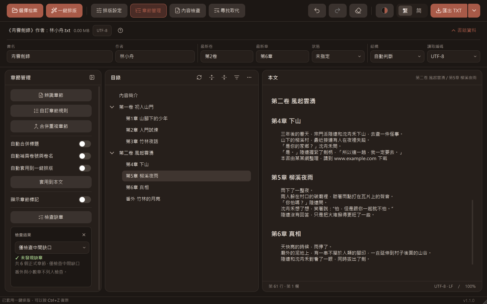
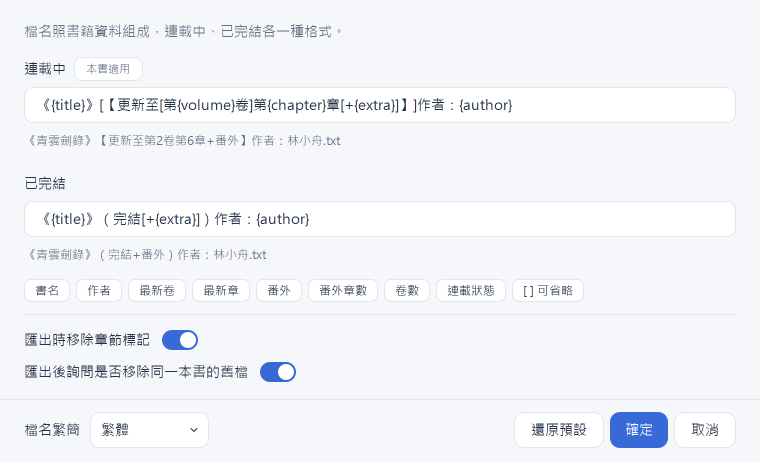

# TXT 排版工具

把網路下載的純文字小說整理乾淨：自動辨識卷與章建立目錄、一鍵排版、找出廣告與作者的話、校對標點，
再照書籍資料組出檔名匯出。Windows 版免安裝，介面可以切換繁體或簡體中文。


> 截圖中的小說《青雲劍錄》是示範用的自編內容。

## 下載

到 [Releases](../../releases) 下載 `txt-tool.exe`（頁面上顯示為「TXT排版工具.exe」），雙擊就能執行，不需要安裝 Python。
沒有數位簽章，第一次開啟時 Windows 可能顯示「Windows 已保護您的電腦」，按「其他資訊」→「仍要執行」。

## 快速上手

1. **選擇檔案**：自動偵測編碼（UTF-8、Big5、GB18030…），辨識卷、章、番外建立目錄，
   從檔名帶出書名、作者與連載狀態。Word 檔（.docx）、EPUB 也可以開，只取文字（EPUB 照閱讀順序，
   標題、段落各一行，書名、作者照 EPUB 裡寫的；有 DRM 加密的打不開）。
   每章一個檔的：選擇檔案旁的箭頭「合併多個檔案…」，或一次拖好幾個檔進視窗，照檔名裡的數字排好順序
   （可以上移、下移），合併成一份新的本文；開頭幾行沒有章節標題的，可以用檔名當章名（只有號碼的寫成「第N章」）。
2. **檢查**：章節管理的「檢查章節」看目錄有沒有漏章、重複、放錯位置、字數異常；內容檢查找廣告、作者的話、標點問題。
3. **一鍵排版**：多餘空行、段首縮排、標題前後空行、編號與章名之間的間隔一次處理。
   想要別的組合，在排版設定調整（改了自動記住，下次一鍵排版就用新的設定）。
4. **匯出 TXT**：檔名照書籍資料組成，例如「《青雲劍錄》【更新至第2卷第6章+番外】作者：林小舟.txt」，
   存成有 BOM 的 UTF-8（Windows 檔案總管的預覽不會變亂碼）。

所有修改都可以按 Ctrl+Z 復原；開檔、匯出都從上次的資料夾開始。

## 功能

最左邊的圖示列（排版、章節、檢查、尋找）開關左側的功能卡片：按一下打開，再按一次或按 Esc 收起，一次只開一張。

### 目錄與章節管理



- 目錄可以摺疊，點一下跳到那一章；本文上方顯示游標所在的卷／章。
  目錄卡片標題列三顆圖示：重新掃描、展開／摺疊（一顆，全部展開時按了摺疊，否則展開）、只顯示章號（#）。
  目錄長到需要捲動時，右下角有「到最前面／到最後面」，本文的游標也一起到開頭／最後一個字。
- **接續更新章節**（「選擇檔案」旁邊的箭頭）：連載中的書又下載了一次新版（原本 1～20 章、現在 1～30 章），
  選新檔案跟本文比對，只加入本文沒有的章。本文整理過（排版、刪廣告、繁簡轉換）也對得上：
  章節用卷、章號、章名對應，不比內容。每一章列成一行：
  - 本文已經有：不動；
  - 本文缺少：補在前一章後面（預設勾選；沒有章號的簡介、感言預設不勾，多半是整理時刪掉的）；
  - 新章節：接在最後（預設勾選）；
  - 新檔比較長：上次下載時這章還沒寫完，勾了就換成新檔的正文（標題留本文的）。

  新檔跟本文繁簡不同時，可以加入時一起轉換；認不出章節時可以「整份接到最後」自己整理。
  加入後目錄會選好新加的章，直接按右鍵「套用格式到這幾章」。一次加入算一步，可以復原。
- 已經開著檔案時把另一個檔案拖進視窗，會出現「開啟新檔」「接續更新章節」兩區，放在哪一區就做哪一件。
- **辨識章節**：用積木組出標題的寫法（外框、前綴、數字、單位、分隔、章名）。
  內建的「第N章」「第N卷」可以關掉單位（例如關掉「節」，「第三節課」就不會變成一章）；
  也可以從常用寫法（#1 標題、Chapter 1、1. 標題…）開始，或貼一行標題自動選好積木。
  序章、番外、後記這類特殊標題可以關掉、設成卷或章，也能自己新增（例如「續章」）。
- **自訂章節規則**：自己寫正則，或貼一行標題自動產生；「本文可疑章節」列出像標題、但還沒進目錄的行，
  依信心勾選（跟掃描視窗同一組按鈕），選到一列時下面顯示前後文，勾好按「加入已勾選項目」。
- **重複章節**（檢查章節結果裡的連結）：同一章被貼了兩次（相鄰、章號相同），列出每一章的正文字數與內容比對（重貼標題、幾乎相同、包含上一個…），勾選要保留的章，其餘刪除；只是標題重貼的，正文會併進留下的那一章。
  不相鄰、內容重複的章（同一章換了標題又貼一次）也會列出來，組號寫「不相鄰」、內容比對寫相同的比例，預設全部保留。
- **檢查章節**：列出跳號、重複的章，點一下跳過去；有重複時旁邊是「處理重複章節」。原文裡有、只是沒被認成章節的，
  會寫出在哪一行、為什麼（例如標題以句號結尾）。範圍在結果最上面選：只看中間缺口、每卷從第 1 章起算、同作品跨卷接續。
  之後改了章節會自動重算（章節管理卡片收起來時不算）。
  放錯位置的章（例如第 7 章排在第 6 章前面）列在「順序錯亂」，按「依章號重排」勾選要搬的，整章搬到該在的位置，不算成缺章。
  字數異常（沒有正文、比一般章短很多或長很多）列前五章，旁邊是「看章節字數」。
  結果最下面「更多」：重複章節（也找章號不同、內容重複的章）、章節字數兩個視窗。
- **章節字數**（檢查章節結果裡的連結）：每一章的字數，標出特別短（可能只剩作者的話）、特別長（可能少了一個標題）的章。
- 預覽開關（目錄和本文先用另一種顏色顯示；開著時目錄上方有一條預覽列，寫出會改什麼，按「套用到本文」才寫入，
  「取消預覽」把開關都關掉）：
  - **自動合併標題**：只有章號的標題（「第1章」）接上下一行的章名；同一章的標題連續出現兩次時只留第一個；
    只有章號、底下緊接著另一個有章名的標題（網站自己的編號＋真正的章標題）只留有章名的那個。
    有章名的空章（書裡自帶的目錄、正文遺失）不會被刪。
  - **自動補齊卷號與卷名**：本文沒寫卷標題時，從卷結尾行（「第一卷終」）、章號重新從 1 起算、
    每章前面的卷（「卷一 山路 第一章」）推出缺少的卷。
  - **自動套用到一鍵排版**：一鍵排版時連同上面的預覽一起寫入，算同一步。
- **顯示章節標記**：把[章節標記](#章節標記)畫出來。
- 目錄是空的、只收到零星幾章，或後半本換了寫法時，目錄上方會提示可以加哪種寫法；有章放錯位置時提示「依章號重排」。
  提示右上角的 ✕：這本書不再提示同一件事（換了別的問題照樣提示）。


### 排版設定


- 開關：整理段落換行（固定字數斷開的段落接回同一行）、刪除多餘空格。
- 下拉：

  | 項目 | 選項 |
  |---|---|
  | 段落之間 | 保留原樣／不空行／空一行 |
  | 標題前後 | 不另加／前後各一行／前兩行、後一行 |
  | 段首縮排 | 保留原樣／兩個全形空格／四個半形空格／不縮排 |
  | 長段落 | 不拆分／只拆高信心／拆高、中信心 |
  | 對話引號 | 保留原樣／「」『』／“”‘’ |
  | 章節編號 | 保留原文／中文數字／阿拉伯數字 |
  | 編號間隔 | 保留原文／半形空格／全形空格／冒號 |
  | 標點符號、數字 | 不轉換／轉全形／轉半形 |

  對話引號一行一行轉：有方向的引號照原本的內外層對應（“ ” 是外層、‘ ’ 是內層），作者漏掉一個結尾引號時只影響那一行；
  直引號（"）同一行成對才轉，英文句子不動。

  長段落：一行超過 300 字的段落，在引號、括號外的句末拆成大約 300 字一段（每段至少 80 字），沿用原本的縮排。
  超過 500 字、引號括號都成對、拆得開句號問號驚嘆號的是高信心；300～500 字、引號沒成對、只能拆在刪節號後面的是中信心。

- 這張卡片就是「一鍵排版」的設定：改了自動記住，按工具列的「一鍵排版」排整份，目錄右鍵「套用格式到這章」只排選取的章。
  第一次用是常用組合：段落之間不空行、標題前兩行後一行、段首兩個全形空格、編號間隔半形空格。
  只排某幾章：在目錄選好，按右鍵「套用格式到這幾章」。

### 內容檢查


- **掃描無關連內容**：網址、下載頁、QQ／微信、小說來源、論壇轉貼資訊，以及網頁字元碼（&#29368;、&nbsp;）、
  HTML 標籤、轉存遺失的字（??）。依信心分級，高信心預設勾選；點一列跳到本文，表格下面顯示前後文。
  夾在正文裡的網址只刪那一段、正文留著；字元碼換回原本的字。
  「重複段落」分頁找出反覆出現的句子，最短長度、至少幾次都可以調；多半是作者慣用的句子，
  所以預設不標在本文上，要在分頁上方打開「標在本文上」才一起上色、快速跳轉。
- **作者感言與作品資訊**：作者、字數、發表平台、章末作者的話。
- 「偵測類型」「檢查項目」的標題本身就是勾選框：點一下全選，全部勾著時再點就全不選。
- 結果表格的勾選：表格左上角的總勾選框全勾或全部取消（勾了一部分時畫「－」）；有信心欄的表格另有「依信心勾選」
  （只勾高信心／勾高、中信心／全部勾選）。
- **繁簡轉換**：全文或只轉選取的章節，可以連用語一起換成台灣用語。
  「詞表」分頁有兩個可以直接編輯的文字框：不轉換的詞（人名、地名，一行一個，照打的寫法保留）、
  用詞對照（一行一組「左邊 = 右邊」，預先填好常見的兩岸用詞，不要的整行刪掉；轉繁體時左換右、轉簡體時右換左）。
- **顯示本文字色**：把廣告、作者感言與作品資訊用不同字色標在本文上，改了本文會在背景重新標示。
  打開後卡片上多一排快速處理：選要標哪幾種信心（預設高、中），上一筆／下一筆逐筆跳，
  「刪除這筆」只刪游標所在的那一筆，刪完停在下一筆（Ctrl+Z 可以復原）；要一次刪很多筆用掃描視窗。
  **顯示內文空格**：把半形／全形空格、Tab 畫出來，行尾多餘的空白標紅。

### 標點校對


- 找出引號沒成對、對話中途斷行、標點在行首、兩段對話黏在一起、太長的分隔線、重複的標點（。。。）、
  太長的破折號與波浪號。
- 「可疑字詞」一組：干擾句點（中文字之間、章號裡的句點：大.走一步、第.1808章，拿掉）、變體字母（英文字裡混著
  長得像的西里爾、希臘字母，多半是網址或帳號，改回英文字母）、星號遮字（中文字旁邊的 **，只列出；預設不勾）。
- 有明確寫法的可以勾選後一次修正，「修正後」欄用紅字標出會改的字；同一本書混用幾種分隔線時可以選一種統一。
- 視窗開著時可以直接改本文，切回視窗會重新檢查。整本是硬換行的書，跨行成對的引號不列，改提示先整理段落換行。

### 尋找取代

- 左側圖示列的「尋找」、Ctrl+F，或 Ctrl+H 直接到取代框。
- 一般模式邊打邊搜；打開正則（.*）後按 Enter 或「搜尋」才執行，輸入框旁邊的「＋」插入常用寫法
  （行首、數字、A 開頭 B 結尾…），取代可以用 `$1`（或 `\1`）代入擷取的內容。
- 下一個／上一個從游標的位置接著找；搜尋開著時改本文，結果不會清掉。

### 書籍資料與匯出



- 檔名列的「書籍資料」展開後可以改書名、作者、連載狀態；最新卷、最新章照目錄自動填入，也可以自己改。
  視窗窄的時候欄位排成兩行。
- 「匯出 TXT」旁邊的箭頭打開**匯出設定**：
  - 連載中、已完結各一種檔名格式，點下面的標籤插入變數（書名、作者、最新卷、最新章、番外…），
    `[ ]` 括起來的段落沒有值時整段省略，下面即時顯示檔名；
  - 檔名轉繁體或簡體；
  - 匯出格式：TXT 或 EPUB（工具列的按鈕跟著變成「匯出 EPUB」）。EPUB 的目錄照 txt-tool 的目錄
    （卷底下的章縮一層），書名、作者照書籍資料，封面是自動產生的文字封面，段首縮排由電子書的樣式處理；
  - 匯出方式：整本一個檔，或每章一個檔（只有 TXT；目錄的每一項存成「0001 第1章 山路.txt」，放進以匯出檔名命名的資料夾，
    用「合併多個檔案」合併回來會得到原本的本文）；
  - 匯出時要不要移除章節標記（EPUB 一律移除）；
  - 匯出後要不要詢問移除同一本書的舊檔（預設要）：接續更新章節之後檔名從「更新至第20章」換成「更新至第30章」，
    匯出的資料夾裡同一本書（書名、作者一樣）的舊檔會列出來，勾選的移到資源回收筒。

### 其他

- 五種主題：簡約白、簡約藍、淺棕色、深色、純黑。
- 檔名列的問號「說明」：章節標記、本文字色的意思，設定檔的位置與「還原預設」。
- 檔名旁的「關閉檔案」：清掉目前的本文與目錄，回到剛啟動的樣子（有沒匯出的修改會先問；不能用上一步復原）。

## 快捷鍵與右鍵選單

| 按鍵 | 作用 |
|---|---|
| Ctrl+O／Ctrl+S | 選擇檔案／匯出 TXT |
| Ctrl+Z／Ctrl+Y（或 Ctrl+Shift+Z） | 復原／重做 |
| Ctrl+F／Ctrl+H | 尋找／取代 |
| Enter／Shift+Enter（尋找框） | 下一個／上一個 |
| Enter（取代框） | 取代這一筆，跳到下一筆（全部取代要按按鈕） |
| Enter（自訂章節規則的正則欄） | 測試本文有幾行符合 |
| F5 | 重新掃描目錄 |
| Esc | 取消剪下的章節，或收起開著的功能卡片 |
| Ctrl+滾輪／Ctrl+0 | 本文字級放大縮小／回到 100%（本文右下角的 − ＋ 也可以，點百分比回到 100%） |
| Ctrl+Shift+L | 打開記錄檔資料夾（回報問題時附上） |

- **目錄右鍵**：複製這章（同時在本文選起來）、剪下並貼到別章前後、套用格式到這章；
  合併、連續編號、設為卷／章標題；移出目錄（保留正文）、刪除。選到卷時照卷底下的章計算。
- **本文右鍵**：新增章節（插在游標那一行前面）、這一行加入目錄／移出目錄。

## 章節標記

在目錄上的手動調整（加入目錄、移出目錄…）會在那一行行尾寫一個標記，存檔、重新開啟都還在；
平常看不到，打開章節管理的「顯示章節標記」才會畫出來。匯出時預設移除（在匯出設定可以改）。

| 標記 | 意思 |
|---|---|
| `[::]` | 手動加入目錄，這一行是章節標題 |
| `[::X]` | 保留正文，手動排除於目錄 |
| `[::W]` | 手動設為作品標題（多作品合集的各部作品） |
| `[::T]` | 手動設為特殊標題（序章、後記這類沒有編號的標題） |

## 設定與資料

設定存在 `%LOCALAPPDATA%\TXTFormatter`：自訂章節規則（`chapter_rules.json`）、排版設定與介面狀態（`ui_state.json`）、
視窗大小（`window.json`）、執行記錄（`logs/`）。換新版 exe 或搬動位置都會保留，原始碼版與 exe 版共用同一份。
說明裡的「還原預設」會刪掉這些設定、帶著目前的檔案重新開啟程式。

## 從原始碼執行

```bash
python -m pip install PySide6 regex
python -m ui_qt
```

`regex` 讓自訂章節規則、尋找的正則有逾時保護（寫壞的正則不會讓程式卡住）。
選用套件：`opencc-python-reimplemented`（簡體介面、檔名與正文的繁簡轉換）。

## 專案結構

```
core/       純邏輯，跟介面無關
  chapter_parse.py       單行章節標題辨識
  title_blocks.py        辨識章節的積木（組合 → 規則）
  user_rules.py          自訂章節規則的比對
  structure_builder.py   整份文件的章節結構／目錄樹、排版
  collection.py          多作品合集、未辨識章節候選、缺章檢查
  ad_scan.py             無關連內容（廣告、網頁字元碼）與作品資訊掃描
  chapter_update.py      接續更新章節（新下載的檔案跟本文比對）
  docx_reader.py         讀 Word（.docx）的文字
  epub_reader.py         讀 EPUB 的文字
  epub_writer.py         匯出 EPUB
  file_merge.py          合併多個檔案
  file_split.py          逐章匯出
  quote_check.py         標點校對
  reflow.py              整理段落換行
  paragraph_split.py     長段落拆分
  filename_meta.py       檔名解析與匯出檔名
  script_convert.py      繁簡轉換（OpenCC）
  persistence.py         規則與介面狀態存檔
  ...

ui_qt/      PySide6 介面
  main_window.py         主視窗（畫面、開檔、目錄、排版、復原）
  window_tools.py        工具視窗與本文字色
  window_toc_edit.py     目錄／本文右鍵操作
  window_state.py        視窗大小、多螢幕、記住上次的介面狀態
  *_panel.py             左側功能卡片（排版設定、章節管理、內容檢查）
  *_dialog.py            各功能視窗
  find_bar.py            尋找取代
  widgets.py             共用元件
  theme.py、icons.py     色彩與樣式表、內嵌 SVG 圖示
  app_log.py             記錄檔與卡死監看
```
